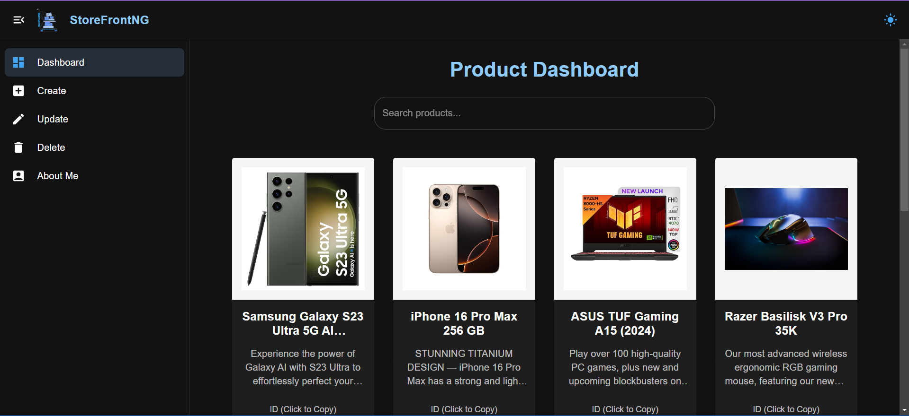

# StoreFrontNG

A full-stack e-commerce application built with the **MERN** stack (MongoDB, Express, React, Node.js), designed for managing and displaying products. The application features a custom API that supports full **CRUD** (Create, Read, Update, Delete) operations using unique product IDs.

## Features

- **User-friendly Dashboard:** A clean and intuitive dashboard to manage products.
- **Product Management:** Easily add, update, delete, and view products.
- **Full CRUD Operations:** Perform CRUD operations with product IDs.
- **Built with MERN Stack:** Uses MongoDB, Express.js, React, and Node.js to power both front-end and back-end.

## Tech Stack

- **MongoDB**: NoSQL database for storing product data.
- **Express.js**: Web framework for Node.js.
- **React**: JavaScript library for building the user interface.
- **Node.js**: JavaScript runtime for the server-side logic.

## Conclusion

Thank you for checking out **StoreFrontNG**! This project demonstrates the power and flexibility of the MERN stack for building a full-stack application. It is designed to be scalable and easy to use for managing product data. Feel free to explore, contribute, and customize the project as per your needs.

## Contact

For any inquiries, suggestions, or if you encounter any issues, please feel free to reach out to me at [nischayagarg008@gmail.com](mailto:nischayagarg008@gmail.com).
